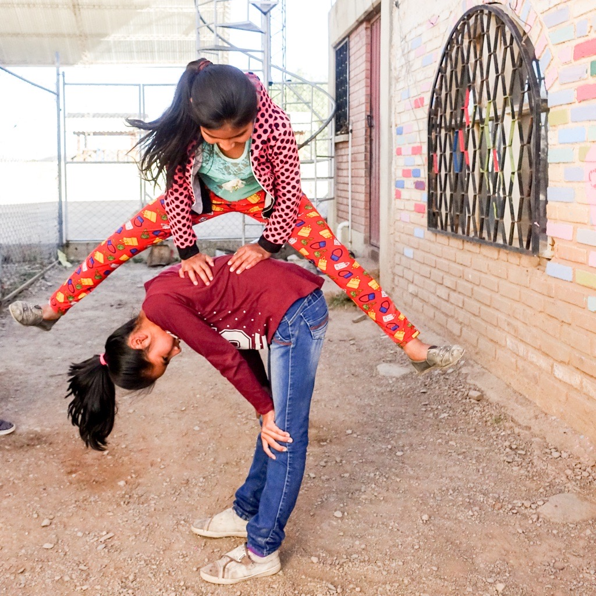

+++ { "kind": "split-image" }

Aquisito e.V.

## Gemeinsam Groß Werden

eine Kooperation zwischen dem Kinder- und Jugendzentrum CADSE in Bolivien und Aquisito e.V. in Deutschland

{button}`Jetzt Spenden <donations.md>`

+++ { "kind": "justified"}

## Aktuelles

:::::{grid} 1 2 3 3
::::{card}
:url: /news_bolivia#libelula
:footer: Libélula

:::{image} ./images/libelula_placeholder.png
:height: 256px
:::

Am 15.05.2024 startete CADSEs und Aquisitos wohl größtes Projekt. Dank der Förderung der Schmitz Stiftung in Höhe von 9.990€ konnte CADSE am 01.07.2024 die ersten Kinder am zweiten Standort von CADSE im Norden von Cochabamba begrüßen.
Ziel ist es, binnen eines Jahres ein von Deutschland unabhängiges Projekt für bis zu 48 Kinder aufzubauen.
::::

::::{card}
:url: /news_bolivia#weiterbildung
:footer: Weiterbildung

Die Engagierten bei CADSE unterstützen die Kinder intensiv im Fach Englisch, da dies von besonderer internationaler Relevanz ist. Allerdings ist der Englischunterricht in Bolivien meist ausbaufähig und deswegen müssen die Freiwilligen bei CADSE viel ergänzende Arbeit leisten. Aus diesem Grund nehmen ausgewählte Engagierte von CADSE an einem mehrmonatigen Englischkurs teil. Die Kosten werden zwischen den Freiwilligen und Aquisito aufgeteilt. 

:::{note}
Aquisito finanzierte 933,30€ Lehrgebühren
:::
::::

::::{card}
:url: /news_bolivia
:footer: Abgeschlossene Projekte

:::{image} ./images/bastel.jpg
:height: 400px
:::

Alle Projekte aus dem Jahr 2023/2024 findest du hier.
::::

:::::

+++ { "kind": "justified"}

:::::{grid} 1 2 2 2

::::{figure} videos/kochbuch.mp4
:width: 2000px
::::

::::{card}
:url: news_germany#kochbuch
:footer: Unser Kochbuch

## Bolivien Kocht
Ein großes Gemeinschaftsprojekt von CADSE und Aquisito ist fertig: Ein Kochbuch, das Deutschland die Türen zur bolivianischen Küche öffnet.
::::

:::::

+++

## Freiwilligendienst bei CADSE

Gemeinsam mit dem Verein Beethovianos Internacional e.V. entsenden wir durch das BMFSFJ finanzierte Freiwillige zu CADSE, sowie an eine Partnerschule in Bolivien. Weitere Infos gibt es unter .

::::{grid} 2 2 2 2
:::{image} ./images/volunteer.jpg
:height: 250px
:::

:::{image} ./images/beethovianos.jpg
:height: 250px
:::
::::

> Wo Mery hingeht, da sind auch Kinder. Diese Kinder fühlen sich geborgen, geliebt und ernst genommen.

::::{figure} images/mery
Mery Torico: Koordinatorin von CADSE in Cochabamba.
::::

Seit 2017 bietet die einheimische Pädagogin Mery mit ihrer Tageseinrichtung CADSE Kindern in Cochabamba (Bolivien) einen sicheren Ort zum Aufwachsen. Neben Hausaufgabenbetreuung erhalten sie die Möglichkeit, sorglos in die Zukunft blicken zu können. Bei Sport-, Kunst- oder Englischunterricht lernen die Kinder Werte wie Zusammenhalt, Selbstbewusstsein und Toleranz kennen, für welche in der Schule keine Zeit bleibt. Wir sind stolz, der gemeinnütziger Partnerverein in Deutschland zu sein!

## `"Aquisito"` ist die spanische Verniedlichung für `"Hier"`
… die vor allem in Cochabamba häufig verwendet wird. Wir von Aquisito e.V. wollen niemanden vorschreiben, was Entwicklungszusammenarbeit ist und wissen auch nicht immer, wo die meiste Unterstützung gebraucht wird. Mery und ihr Team kommen selbst aus dem Stadtteil und kennen die Bedürfnisse und Umstände der Familien. Aus diesem Grund kann CADSE lokal und gezielt Probleme anpacken.

+++ { "kind": "justified"}

## Das Team

:::::{grid} 2 3 3 3
::::{card}
:footer: Toni

:::{image} ./images/toni.jpg
:height: 256px
:::

Erste Vorsitzende\
\
toni@aquisito.de

::::

::::{card}
:footer: Natha

:::{image} ./images/natha.jpg
:height: 256px
:::

Stellvertretende Vorsitzende\
Kooperationen\
nathalie@aquisito.de

::::

::::{card}
:footer: Thomas

:::{image} ./images/thomas.jpeg
:height: 256px
:::

Rechnungsführer\
Finanzen & Kooperationen\
thomas@aquisito.de

::::

{button}`Zur Teamübersicht <team.md>`

:::::

+++

:::::{grid} 1 2  2
### [Wir sind Teil der Initiative Transparente Zivilgesellschaft](transparency)

:::{image} ./images/Transparente_ZivilgesellschaftPNG.png
:::
:::::

+++ { "kind": "centered"}

:::{image} ./images/sonne.svg
:height: 256px
:::

