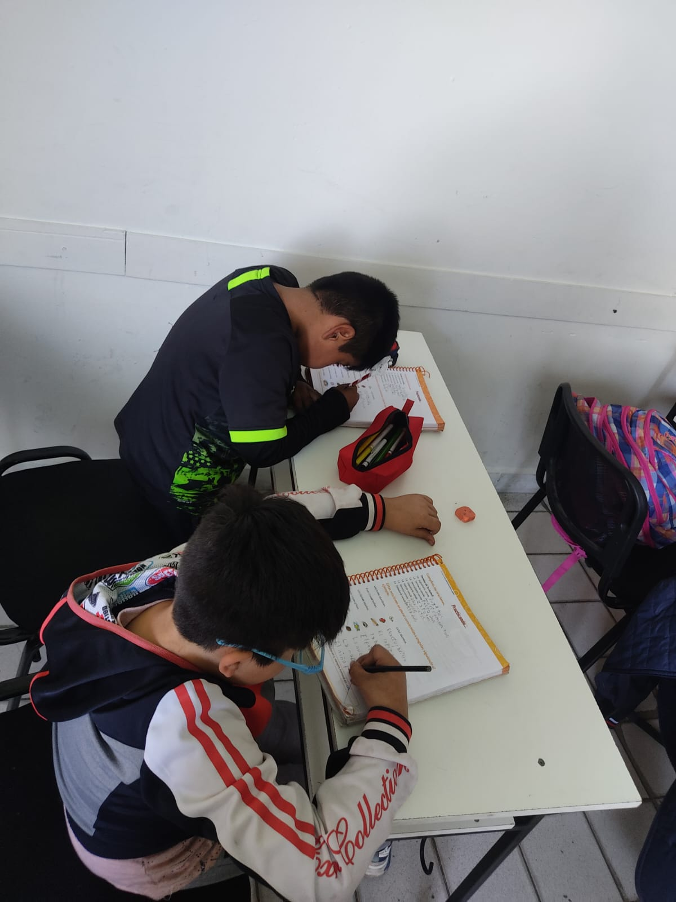

# Neues Aus Bolivien

:::{warning} Technische Schwierigkeiten
Leider sind unsere News-Blogs im Moment nicht verfügbar. 
:::

# Projekte bei CADSE

Hier findest du aktuelle und vergangene Projekte, die CADSE 2022, 2023 und 2024 durchgeführt hat. Zusätzlich geben wir den Anteil an, den Aquisito finanziert.

## Projekte im Jahr 2024

:::::{grid} 1 1 1 1
:gutter: 3
:class-container: full-width

::::{card} Libélula: Kinderzentrum
:header: **Laufendes Großprojekt** 🚀 (Start: 15.05.2024)
:link: #libelula
:shadow: md
:img-top: images/libelula_placeholder.png

**Projektbeschreibung:** Das größte Projekt, gefördert durch die Schmitz Stiftung. Im Kinderzentrum "Libélula" erhalten Kinder ab 4 Jahren Förderung nach der Montessori-Pädagogik in Bildung, sozialem Lernen, Gesundheit und Motorik.
+++
**Status & Ziel:** Das Projekt befindet sich im Wachstumsprozess. Ziel ist ein von Deutschland unabhängiges Projekt für bis zu 48 Kinder.
**Projektbilder:**
 
::::{grid} 1 2 3 3
:gutter: 1
:class-container: card-image-grid-small
 
:::{grid-item-card}

:::
 
:::{grid-item-card}

:::
 
:::{grid-item-card}

:::
 
:::{grid-item-card}

:::
 
:::{grid-item-card}

:::
 
:::{grid-item-card}

:::
::::
::::

:::::

:::::{grid} 1 2 3 3
:gutter: 3

::::{card} Schulische Bildung
:header: **Laufend** (01.02.2024 - 30.11.2024)
:link: #schulische-bildung
:shadow: md
:img-top: images/libelula_placeholder.png

**Projektbeschreibung:** Umfassende Förderung für Kinder und Jugendliche mit Hausaufgabenbegleitung, bildenden Workshops und gezielter Unterstützung in Kreativität, Sport, Ernährung und Englisch.
+++
**Aquisito finanzierte:** 1.472,95 € (Material, Koordination, Ausstattung).
::::

::::{card} Verwaltung (Koordinierung)
:header: **Jährlich** (01.01.2024 - 31.12.2024)
:link: #verwaltung
:shadow: md
:img-top: images/libelula_placeholder.png

**Projektbeschreibung:** Finanzierung der Koordination von CADSE durch Mery, um die Zusammenarbeit mit Freiwilligen, den Austausch mit Aquisito und die Projektplanung sicherzustellen.
+++
**Aquisito finanzierte:** 2.410,27 € (Koordinierende Fachkraft).
::::

::::{card} Schulung (Nagelpflege/-design)
:header: **Abgeschlossen** (01.03.2024 - 31.07.2024)
:link: #schulung
:shadow: md
:img-top: images/libelula_placeholder.png

**Projektbeschreibung:** Mehrwöchiger Kurs zur Berufsförderung von 16 arbeitssuchenden Frauen. Zwei Teilnehmerinnen fanden nach Übung von Vorstellungsgesprächen eine feste Anstellung.
+++
**Aquisito finanzierte:** 468,66 € (Materialien).
::::

::::{card} Familienschule
:header: **Laufend** (23.03.2024 - 14.12.2024)
:link: #familienschule
:shadow: md
:img-top: images/libelula_placeholder.png

**Projektbeschreibung:** Monatliche Elternschule unter Anleitung von Experten der Universität San Simon. Ziel ist die Verbesserung von Beziehungen, Kommunikation und Familienzugehörigkeit.
+++
**Aquisito finanzierte:** 348,15 € (Seminarmaterialien, Externe, Verpflegung).
::::

::::{card} Internet für CADSE
:header: **Infrastruktur** (01.01.2024 - 31.12.2024)
:link: #internet
:shadow: md
:img-top: images/libelula_placeholder.png

**Projektbeschreibung:** Finanzierung des WLAN-Vertrags, wodurch Kinder seit April 2023 ihre Medienkompetenz an Laptops ausbauen können.
+++
**Aquisito finanzierte:** 239,42 € (Internetvertrag).
::::

::::{card} Fußballschule (Materialien)
:header: **Abgeschlossen** (01.02.2024 - 29.02.2024)
:link: #fussballschule
:shadow: md
:img-top: images/libelula_placeholder.png

**Projektbeschreibung:** Die selbstfinanzierte Fußballschule benötigte einmalig neue Materialien (Bälle, Hütchen) zur Aufrechterhaltung des Betriebs.
+++
**Aquisito finanzierte:** 401,71 € (Trainerin, Hütchen, etc.).
::::

::::{card} Hygiene-Projekt
:header: **Abgeschlossen** (01.03.2024 - 31.07.2024)
:link: #hygiene
:shadow: md
:img-top: images/libelula_placeholder.png

**Projektbeschreibung:** Übung von alltäglichen Hygienemaßnahmen wie Zähneputzen und Händewaschen. Besonders wichtig aufgrund der unsicheren Wasserversorgung in den Haushalten.
+++
**Aquisito finanzierte:** 93,74 € (Materialien).
::::

::::{card} Fußballturnier
:header: **Abgeschlossen** (30.03.2024)
:link: #fussballturnier
:shadow: md
:img-top: images/libelula_placeholder.png

**Projektbeschreibung:** Ein im Stadtteil veranstaltetes Turnier zur Förderung gemeinsamer Erlebnisse und zur Werbung für die Fußballschule.
+++
**Aquisito finanzierte:** 40,17 € (Medaillen, Obst).
::::

::::{card} Jahresbeginn (Schulvorbereitung)
:header: **Abgeschlossen** (08.01.2024 - 26.01.2024)
:link: #jahresbeginn
:shadow: md
:img-top: images/libelula_placeholder.png

**Projektbeschreibung:** Nutzung der Ferienzeit zur individuellen Aufarbeitung von Herausforderungen des Vorjahres, um alle Kinder mit gleichem Wissen ins neue Schuljahr zu starten.
+++
**Aquisito finanzierte:** 33,48 € (Koordinierende Fachkraft).
::::
:::::

## Projekte im Jahr 2023

:::::{grid} 1 2 3 3
:gutter: 3

::::{card} Weiterbildung (Englisch)
:header: **Abgeschlossen** (01.12.2023 - 31.03.2023)
:link: #weiterbildung-2023
:shadow: sm
:img-top: images/libelula_placeholder.png

**Beschreibung:** Mehrmonatiger Englischkurs für ausgewählte Engagierte von CADSE, um die Qualität des Englischunterrichts zu verbessern.
+++
**Aquisito finanzierte:** 933,30 € (Lehrgebühren).
::::

::::{card} Jahresabschluss & Canastones
:header: **Abgeschlossen** (22.12.2023)
:link: #jahresabschluss-2023
:shadow: sm
:img-top: images/libelula_placeholder.png

**Beschreibung:** Verteilung von *Canastones* (Körbe mit gesunden Lebensmitteln) an die Kinder als Belohnung für die Teilnahme und Motivation für das neue Schuljahr (bolivianische Tradition).
+++
**Aquisito finanzierte:** 263,62 € (Essen).
::::

::::{card} Ferienplan 2
:header: **Abgeschlossen** (15.11.2023 - 22.12.2023)
:link: #ferienplan-2023
:shadow: sm
:img-top: images/libelula_placeholder.png

**Beschreibung:** Zwei Wochen Ferienspaß und Bildung am Ende des bolivianischen Schuljahres. Workshops zu Backen, Basteln, Kreativität und Geschichtenerzählen.
+++
**Aquisito finanzierte:** 94,92 € (Koordination, Materialien).
::::

:::::

## Projekte im Jahr 2022

:::::{grid} 1 2 3 3
:gutter: 3

::::{card} Sicherheits-maßnahmen
:header: **Abgeschlossen** (09.12.2022)
:link: #sicherheit-2022
:shadow: sm
:img-top: images/libelula_placeholder.png

**Beschreibung:** Anschaffung von vier Fenstergittern und einer Türvergitterung zum Schutz von CADSE vor Einbrüchen und Diebstählen.
+++
**Aquisito finanzierte:** 560,66 € (Türvergitterung).
::::

::::{card} Jahresabschluss & Körbe
:header: **Abgeschlossen** (17.12.2022)
:link: #jahresabschluss-2022
:shadow: sm
:img-top: images/libelula_placeholder.png

**Beschreibung:** Verteilung von Körben mit gesunden Lebensmitteln an regelmäßig teilnehmende Kinder und Mitarbeiter:innen als Dank und Motivation.
+++
**Aquisito finanzierte:** 208,31 € (Material, Verpflegung).
::::

::::{card} Abschied Picaflor
:header: **Abgeschlossen** (05.11.2022)
:link: #abschied-picaflor
:shadow: sm
:img-top: images/libelula_placeholder.png

**Beschreibung:** Verabschiedung der Freiwilligen der Organisation Picaflor, die sich über einen längeren Zeitraum sehr vielseitig bei den Projekten von CADSE eingebracht hatten.
+++
**Aquisito finanzierte:** 30,70 € (Fotos, Verpflegung).
::::

:::::